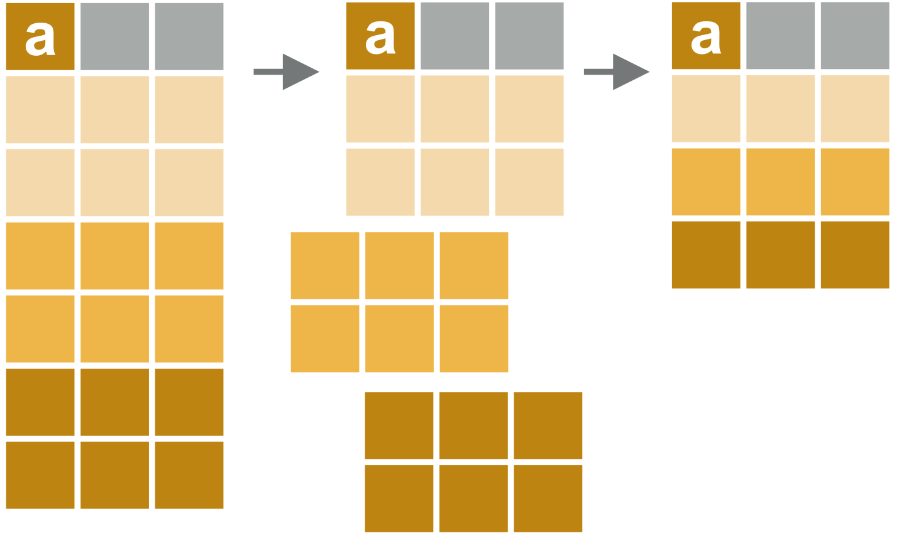

```{r setup, include=FALSE, eval = TRUE}
knitr::opts_chunk$set(echo = TRUE, eval = FALSE)
library(data.table)
library(tidyverse)
```

## Getting started 


:::: {style="display: grid; grid-template-columns: 1fr 1fr; grid-column-gap: 10px;"}

::: {}
```{r, out.width = "120px", eval = TRUE, echo = FALSE}

```
:::


::: {}

### data.table package

```{r, eval = FALSE, class.source="bg-success", class.output="bg-warning"}
# data.table
install.packages("data.table")
library(data.table)
```
:::

::::


:::: {style="display: grid; grid-template-columns: 1fr 1fr; grid-column-gap: 10px;"}

::: {}
```{r, out.width = "120px", eval = TRUE, echo = FALSE}

```
:::

::: {}
### dplyr package from the tidyverse
```{r, eval = FALSE, class.source="bg-info", class.output="bg-danger"}
install.packages("tidyverse")
library(tidyverse)
```
:::
::::


## data.table basics

- Data tables are a special kind of data frame (anything you can do with a data frame you can do with a data table)
- The general ethos is for conscise coding (doesn't take up too much space in your code)


### Define a data table (example):
:::: {style="display: grid; grid-template-columns: 1fr 1fr; grid-column-gap: 10px;"}
::: {}
```{r, eval = TRUE, class.source="bg-success", class.output="bg-warning"}

DT <- data.table(A = 1:5,
                 B = c("Red", "Blue", "Red", "Blue", "Blue"),
                 C = c(TRUE, TRUE, TRUE, TRUE, FALSE))
```
:::
::: {}
```{r, eval = TRUE, class.source="bg-success", class.output="bg-warning"}
DT
```
:::
::::


### Basic data table notation
```{r, out.width = "300px", eval = TRUE, echo = FALSE}
knitr::include_graphics("./images/basicnotation.png")
```

#### Selecting an element in a table 

:::: {style="display: grid; grid-template-columns: 1fr 1fr; grid-column-gap: 10px;"}
::: {}
```{r, eval = TRUE, class.source="bg-success", class.output="bg-warning"}
DT[1, 2] # outputs a (single element) data table 
DT[1, "B"] # equivalent - outputs a data table
```
:::
::: {}
```{r, eval = TRUE, class.source="bg-success", class.output="bg-warning"}
DT[1, .(B)] # - outputs a data table
DT[1, B] # - outputs a vector
```
:::
::::

:::: {style="display: grid; grid-template-columns: 1fr 1fr; grid-column-gap: 10px;"}
::: {}
#### Selecting multiple elements in a table   
```{r, eval = TRUE, class.source="bg-success", class.output="bg-warning"}
DT[1:3, c("B", "C")] 
```
:::
::: {}
```{r, eval = TRUE, class.source="bg-success", class.output="bg-warning"}
DT[1:3, .(B, C)] 
```
:::
::::


### Basic changes to a data table:
#### Add a column
```{r, eval = TRUE, class.source="bg-success", class.output="bg-warning"}
# Add a column
DT[, D := rep(-1, 5)]
DT
```

#### Change a value according to a rule
```{r, eval = TRUE, class.source="bg-success", class.output="bg-warning"}
DT[B == "Red", D := 99]
DT
```

#### Rename columns
```{r, eval = TRUE, class.source="bg-success", class.output="bg-warning"}
setnames(DT, 
         old = c("A", "C"), 
         new = c("A1", "C1")) 
# The 'old =' and 'new =' are optional but helpful
DT

```

#### Delete a column
```{r, eval = TRUE, class.source="bg-success", class.output="bg-warning"}
DT[, C1 := NULL]
DT

```


### Common operators
```{r, eval = TRUE, class.source="bg-success", class.output="bg-warning"}
# sum a column
DT[, sum(D)]
DT[, .(sum(D), mean(D))]
DT[, .(sumOfD = sum(D),
       meanOfD = mean(D))]

# Define a new column based on other columns
DT[, E := D - A1]
DT[A1 > 2, F := 0]
DT

# Get the number of rows (.N operator)
DT[, .N] # number of rows in D
DT[B == "Blue", .N] # number of rows with B = Blue

```

### Group by
:::: {style="display: grid; grid-template-columns: 1fr 1fr; grid-column-gap: 10px;"}

::: {}
```{r, out.width = "200px", eval = TRUE, echo = FALSE}

```

:::

:::{}
```{r, eval = TRUE, class.source="bg-success", class.output="bg-warning"}
DT[, .N, by = B]
```
:::
::::

```{r, eval = TRUE, class.source="bg-success", class.output="bg-warning"}

DT[, .N, by = .(B, F)]

```

### Key by
```{r, eval = TRUE, class.source="bg-success", class.output="bg-warning"}

DT[, .N, keyby = .(B, F)]

```


## Reading from and writing to csv files

- data.table is very fast at writing and reading data
- Functions **fwrite()** and **fread()** (creates a data table automatically)

```{r, eval = FALSE, class.source="bg-success", class.output="bg-warning"}
fread("my/file/path/data_name.csv")

fwrite(DT, file = "my/file/path/data_name.csv")

```

## Combine multiple data tables with rbindlist

```{r, eval = TRUE, class.source="bg-success", class.output="bg-warning"}

DT2 <- rbindlist(list(DT, DT[1:3]))
DT2

# Or you can do both instructions together:
# rbindlist(lapply(c("DT.csv", "DT.csv"), fread))
```


```{r, eval = FALSE, class.source="bg-success", class.output="bg-warning"}
n <- 10^9
fakeData <- data.table(a = 1:n,
                       b = rnorm(n),
                       d = rnorm(n)*n)

t <- proc.time()
fwrite(fakeData, 
       file = "./fakeDataTable.RData")
proc.time() - t # elapsed 8.20

t <- proc.time()
fread("./fakeDataTable.RData")
proc.time() - t # elapsed 3.48

```


## Figures

ggplot2 is part of the tidyverse and data.table is not - but this isn't a problem for integrating the two. Consider the following example which uses the penguins dataset

```{r, eval = TRUE, class.source="bg-success", class.output="bg-warning"}

# install.packages("remotes")
# remotes::install_github("allisonhorst/palmerpenguins")

library(palmerpenguins)
penguins_dt <- as.data.table(penguins)

peng_plot1 <- ggplot(penguins_dt[!is.na(year), 
                                 .N, 
                                 keyby = .(island, year)],
                     aes(x = island,
                         y = N,
                         fill = as.factor(year))) + 
  geom_bar(stat = "identity", 
           position = position_dodge()) +
  labs(x = "Island",
       y = "Number of penguins by sex", 
       fill = "Year") 


penguins_dt[!is.na(year), 
                                 .N, 
                                 keyby = .(island, year)]
```

```{r, echo = FALSE, message = FALSE, warning = FALSE, eval = TRUE}
peng_plot1
```


## Column names as variables
The **get** and **eval** functions can be used to treat column names as variables. Consder the following example. We want to replace high outliers in each numeric column with NA (this isn't a scientifically robust plan but it's helpful to illustrate here).

```{r, eval = TRUE, class.source="bg-success", class.output="bg-warning"}

## Jonno I'm struggling with the example it doesn't make much sense and I'm not sure if it's actually worked. Do you see what I'm trying to do? Any thoughts? 

cols_for_analysis <- c("bill_length_mm", 
                       "bill_depth_mm", 
                       "flipper_length_mm",
                       "body_mass_g")

outlier_tolerance <- 1  # 3 x standard deviation

for(i in cols_for_analysis) {
  penguins_dt[get(i) > mean(get(i),
                            na.rm = TRUE) +
                outlier_tolerance * sd(get(i),
                                       na.rm = TRUE),
              eval(i) := NA]
}


```


## tibble basics

- Tibbles are a special kind of data frame (anything you can do with a data frame you can do with a data table)
- The general ethos is for code that is easy to understand


### Define a data table (example):
:::: {style="display: grid; grid-template-columns: 1fr 1fr; grid-column-gap: 10px;"}
::: {}
```{r, eval = TRUE, class.source="bg-info", class.output="bg-danger"}

df <- tibble(A = 1:5,
                 B = c("Red", "Blue", "Red", "Blue", "Blue"),
                 C = c(TRUE, TRUE, TRUE, TRUE, FALSE))
```
:::
::: {}
```{r, eval = TRUE, class.source="bg-info", class.output="bg-danger"}
df
```
:::
::::


#### Selecting an element in a table 

:::: {style="display: grid; grid-template-columns: 1fr 1fr; grid-column-gap: 10px;"}
::: {}
```{r, eval = TRUE, class.source="bg-info", class.output="bg-danger"}
df[1, 2] # outputs a (single element) a tibble
df[1, "B"] # equivalent - outputs a data table
```
:::

::: {}
```{r, eval = TRUE, class.source="bg-info", class.output="bg-danger"}
df[1, ] %>% select(B) # - outputs a data table
df[1, "B"] %>% pull # - outputs a vector
```
:::
::::

:::: {style="display: grid; grid-template-columns: 1fr 1fr; grid-column-gap: 10px;"}
::: {}
#### Selecting multiple elements in a table   
```{r, eval = TRUE, class.source="bg-info", class.output="bg-danger"}
df[1:3, c("B", "C")]
```
:::
::: {}
```{r, eval = TRUE, class.source="bg-info", class.output="bg-danger"}
df %>% select(B, C) %>% slice(1:3)
```
:::
::::


### Basic changes to a data table:
#### Add a column
```{r, eval = TRUE, class.source="bg-info", class.output="bg-danger"}
# Add a column
df <- df %>% mutate(D = rep(-1, 5))
df
```

#### Change a value according to a rule

```{r, eval = TRUE, class.source="bg-info", class.output="bg-danger"}
df <- df %>% mutate(D = ifelse(B=="Red", 99, D ))
df
```

#### Rename columns
```{r, eval = TRUE, class.source="bg-info", class.output="bg-danger"}
df <- df %>% rename(A1 = A,
                    C1 = C)
df

```

#### Delete a column
```{r, eval = TRUE, class.source="bg-info", class.output="bg-danger"}
df %>% select(-C1)

```


### Common operators
```{r, eval = TRUE, class.source="bg-info", class.output="bg-danger"}
# sum a column
sum(df$D)
df %>% summarise(sum = sum(D),
                 mean = mean(D))

df %>% 
  summarise(across(.cols = D, .fns = c(sum, mean)))

# Define a new column based on other columns
df <- df %>% mutate(E = D-A1,
                    F = ifelse(A1>2, 0, F))

df

# Get the number of rows
nrow(df)
df %>% summarise(B = sum(B=="Blue")) # number of rows with B = Blue

```

### Group by
:::: {style="display: grid; grid-template-columns: 1fr 1fr; grid-column-gap: 10px;"}

::: {}
```{r, out.width = "200px", eval = TRUE, echo = FALSE}

```

:::

:::{}
```{r, eval = TRUE, class.source="bg-info", class.output="bg-danger"}
df %>% group_by(B) %>% summarise(counts = n())
```
:::
::::

```{r, eval = TRUE, class.source="bg-info", class.output="bg-danger"}

df %>% group_by(B, F) %>% summarise(counts = n())


```

### Key by
The dplyr equivalent is just to arrange the rows
```{r, eval = TRUE, class.source="bg-info", class.output="bg-danger"}

df <- df %>% arrange(B, F)

```


## Reading from and writing to csv files

- data.table is very fast at writing and reading data
- Functions **fwrite()** and **fread()** (creates a data table automatically)

```{r, eval = FALSE, class.source="bg-info", class.output="bg-danger"}

read.csv("my/file/path/data_name.csv")
write.csv("my/file/path/data_name.csv")

library(readr)
#readr version is much faster than base
read_csv("my/file/path/data_name.csv") 
write_csv("my/file/path/data_name.csv")

```

## Combine multiple data tables with rbindlist

```{r, eval = TRUE, class.source="bg-info", class.output="bg-danger"}


df2 <- list(df, df[1:3,]) %>% bind_rows()

#To load multiple files into a single data frame use map_df from the purrr package (another core tidyverse package)
# df1 <- c("DT.csv", "DT.csv") %>%
#   map_df(read_csv)

```


## Figures


```{r, eval = TRUE, class.source="bg-info", class.output="bg-danger"}

# install.packages("remotes")
# remotes::install_github("allisonhorst/palmerpenguins")

library(palmerpenguins)

peng_plot2 <- penguins %>%
  group_by(island, year) %>%
  summarise(N = n()) %>%
  ggplot(aes(x = island, y = N, fill = factor(year))) +
  geom_col(position = "dodge") +
  labs(x = "Island",
       y = "Number of penguins by sex", 
       fill = "Year") 
```


```{r, echo = FALSE, message = FALSE, warning = FALSE, eval = TRUE}
peng_plot2
```


## Column names as variables
The **get** and **eval** functions can be used to treat column names as variables. Consder the following example. We want to replace high outliers in each numeric column with NA (this isn't a scientifically robust plan but it's helpful to illustrate here).

```{r, eval = TRUE, class.source="bg-info", class.output="bg-danger"}

penguins_dt <- as.data.table(penguins)

cols_for_analysis <- c("bill_length_mm", 
                       "bill_depth_mm", 
                       "flipper_length_mm",
                       "body_mass_g")

#I suggest this as the piece of code as it is easier to read, but it is your choice, my bit of code can be changed to match
for(i in cols_for_analysis) {
  penguins_dt[get(i) > mean(get(i), na.rm = TRUE), eval(i) := NA]
}

#The `all_of` function makes it explicit when you are using data from outside the data frame. This prevents issues occuring when a column in the data frame has the same name as a vector somewhere else in the workspace
test2 <- penguins %>%
  mutate(across(.cols = all_of(cols_for_analysis), 
                .fns = ~ifelse(.x > mean(.x, na.rm = TRUE), NA, .x)
                )
         )

```


# Resources

- [data.table wiki](https://github.com/Rdatatable/data.table/wiki/Getting-started)

- [Steph Locke (data) table wrangling](http://stephlocke.info/Rtraining/tablewrangling.html)

- [A data table and dplyr tour](https://atrebas.github.io/post/2019-03-03-datatable-dplyr/)

