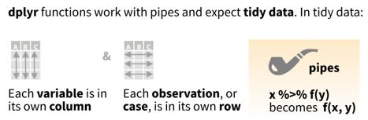
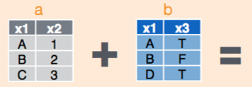
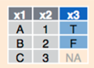
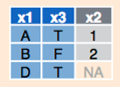
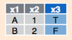

```{r setup, include=FALSE, eval = TRUE}
knitr::opts_chunk$set(echo = TRUE, eval = FALSE)
library(data.table)
library(tidyverse)

user <- "EW"
if(user == "EW") {
  dir <- "C:/Users/Ellen Webborn/OneDrive - University College London/Documents/R/bseeR user group/dataTableDplyrTalk"
}
```

# Getting started 

:::: {style="display: grid; grid-template-columns: 1fr 1fr; grid-column-gap: 10px;"}

::: {}
```{r, out.width = "120px", eval = TRUE, echo = FALSE}
knitr::include_graphics("./images/datatablesticker.png")
```

```{r, eval = FALSE, class.source="bg-success", class.output="bg-warning"}
install.packages("data.table")
library(data.table)
```
:::


::: {}
```{r, out.width = "120px", eval = TRUE, echo = FALSE}
knitr::include_graphics("./images/dplyrsticker.png")
```

```{r, eval = FALSE, class.source="bg-info", class.output="bg-warning"}
install.packages("tidyverse") # or "dplyr"
library(tidyverse)
```
:::

::::


# Basic concept

:::: {style="display: grid; grid-template-columns: 1fr 1fr; grid-column-gap: 10px;"}

::: {}

- Data tables are a special kind of data frame 
- The general ethos is for conscise code
- Known to be fast and memory-efficient, particularly for csv files and filtering

```{r, out.width = "170px", eval = TRUE, echo = FALSE}
knitr::include_graphics("./images/basicnotation.png")
```
:::

::: {}
- Tibbles are a special kind of data frame (anything you can do with a data frame you can do with a data table)
- The general ethos is for code that is easy to understand
- Memory efficient for summarising, if not so fast
```{r, out.width = "400px", eval = TRUE, echo = FALSE}

```
:::
::::


# Creating a simple data.table/tibble:
:::: {style="display: grid; grid-template-columns: 1fr 1fr; grid-column-gap: 10px;"}
::: {}
```{r, eval = TRUE, class.source="bg-success", class.output="bg-warning"}

DT <- data.table(A = 1:5,
                 B = c("Red", "Blue", "Red", "Blue", "Blue"),
                 C = c(TRUE, TRUE, TRUE, TRUE, FALSE))

DT
```
:::
::: {}
```{r, eval = TRUE, class.source="bg-info", class.output="bg-warning"}

df <- tibble(A = 1:5,
                 B = c("Red", "Blue", "Red", "Blue", "Blue"),
                 C = c(TRUE, TRUE, TRUE, TRUE, FALSE))

df
```
:::
::::


# Selecting an element in a table 

:::: {style="display: grid; grid-template-columns: 1fr 1fr; grid-column-gap: 10px;"}
::: {}
```{r, eval = TRUE, class.source="bg-success", class.output="bg-warning"}
DT[1, 2] # outputs a (single element) data table 
DT[1, "B"] # equivalent - outputs a data table
DT[1, .(B)] # - outputs a data table
DT[1, B] # - outputs a vector
```
:::
::: {}
```{r, eval = TRUE, class.source="bg-info", class.output="bg-warning"}
df[1, 2] # outputs a tibble
df[1, "B"] # equivalent - outputs 
df[1, ] %>% select(B) # - outputs
df[1, "B"] %>% pull # - outputs a vector
```
:::
::::


# Selecting multiple elements in a table  

:::: {style="display: grid; grid-template-columns: 1fr 1fr; grid-column-gap: 10px;"}
::: {}
```{r, eval = TRUE, class.source="bg-success", class.output="bg-warning"}
DT[1:3, c("B", "C")] 
DT[1:3, .(B, C)] 
```
:::
::: {}
```{r, eval = TRUE, class.source="bg-info", class.output="bg-warning"}
df[1:3, c("B", "C")]
df %>% select(B, C) %>% slice(1:3)
```

:::
::::


# Making basic changes
## Add a column
:::: {style="display: grid; grid-template-columns: 1fr 1fr; grid-column-gap: 10px;"}
::: {}
```{r, eval = TRUE, class.source="bg-success", class.output="bg-warning"}
DT[, D := rep(-1, 5)]
DT
```
:::
::: {}
```{r, eval = TRUE, class.source="bg-info", class.output="bg-warning"}
df <- df %>% mutate(D = rep(-1, 5))
df
```
:::
::::


## Change a value according to a rule
:::: {style="display: grid; grid-template-columns: 1fr 1fr; grid-column-gap: 10px;"}
::: {}
```{r, eval = TRUE, class.source="bg-success", class.output="bg-warning"}
DT[B == "Red", D := 99]
DT
```
:::
::: {}
```{r, eval = TRUE, class.source="bg-info", class.output="bg-warning"}
df <- df %>% mutate(D = ifelse(B=="Red", 99, D ))
df
```
:::
::::


## Rename columns
:::: {style="display: grid; grid-template-columns: 1fr 1fr; grid-column-gap: 10px;"}
::: {}
```{r, eval = TRUE, class.source="bg-success", class.output="bg-warning"}
setnames(DT, 
         old = c("A", "C"), 
         new = c("A1", "C1")) 
# The 'old =' and 'new =' are optional but helpful
DT
```
:::
::: {}
```{r, eval = TRUE, class.source="bg-info", class.output="bg-warning"}
df <- df %>% rename(A1 = A,
                    C1 = C)
df
```
:::
::::


## Delete a column
:::: {style="display: grid; grid-template-columns: 1fr 1fr; grid-column-gap: 10px;"}
::: {}
```{r, eval = TRUE, class.source="bg-success", class.output="bg-warning"}
DT[, C1 := NULL]
DT
```
:::
::: {}
```{r, eval = TRUE, class.source="bg-info", class.output="bg-warning"}
df %>% select(-C1)
```
:::
::::


# Common operators

## Column sum
:::: {style="display: grid; grid-template-columns: 1fr 1fr; grid-column-gap: 10px;"}
::: {}
```{r, eval = TRUE, class.source="bg-success", class.output="bg-warning"}
DT[, sum(D)]
```
:::
::: {}
```{r, eval = TRUE, class.source="bg-info", class.output="bg-warning"}
sum(df$D)
```
:::
::::

## Multiple column operations (with multiple outputs)
:::: {style="display: grid; grid-template-columns: 1fr 1fr; grid-column-gap: 10px;"}
::: {}
```{r, eval = TRUE, class.source="bg-success", class.output="bg-warning"}
DT[, .(sum(D), mean(D))]
```
:::
::: {}
```{r, eval = TRUE, class.source="bg-info", class.output="bg-warning"}
df %>% 
  summarise(across(.cols = D, .fns = c(sum, mean)))
```
:::
::::

## Multiple column operations (naming the outputs in a table)
:::: {style="display: grid; grid-template-columns: 1fr 1fr; grid-column-gap: 10px;"}
::: {}
```{r, eval = TRUE, class.source="bg-success", class.output="bg-warning"}
DT[, .(sumOfD = sum(D),
       meanOfD = mean(D))]
```
:::
::: {}
```{r, eval = TRUE, class.source="bg-info", class.output="bg-warning"}
df %>% summarise(sum = sum(D),
                 mean = mean(D))
```
:::
::::


## Add a new column based on other columns
:::: {style="display: grid; grid-template-columns: 1fr 1fr; grid-column-gap: 10px;"}
::: {}
```{r, eval = TRUE, class.source="bg-success", class.output="bg-warning"}
DT[, E := D - A1]
DT[A1 > 2, F := 0]
DT
```
:::
::: {}
```{r, eval = TRUE, class.source="bg-info", class.output="bg-warning"}
df <- df %>% mutate(E = D-A1,
                    F = ifelse(A1>2, 0, F))
df
```
:::
::::

## Get the number of rows
:::: {style="display: grid; grid-template-columns: 1fr 1fr; grid-column-gap: 10px;"}
::: {}
```{r, eval = TRUE, class.source="bg-success", class.output="bg-warning"}
DT[, .N] # number of rows 
DT[B == "Blue", .N] # number of rows with B = Blue
```
:::
::: {}
```{r, eval = TRUE, class.source="bg-info", class.output="bg-warning"}
nrow(df) 
df %>% summarise(B = sum(B=="Blue")) 
```
:::
::::


# Group by
```{r, out.width = "200px", eval = TRUE, echo = FALSE}
knitr::include_graphics("./images/groupby.png")
```


:::: {style="display: grid; grid-template-columns: 1fr 1fr; grid-column-gap: 10px;"}
::: {}
```{r, eval = TRUE, class.source="bg-success", class.output="bg-warning"}
DT[, .N, by = B]
```
:::

:::{}
```{r, eval = TRUE, class.source="bg-info", class.output="bg-warning"}
df %>% group_by(B) %>% summarise(counts = n())
```
:::
::::


:::: {style="display: grid; grid-template-columns: 1fr 1fr; grid-column-gap: 10px;"}
::: {}
```{r, eval = TRUE, class.source="bg-success", class.output="bg-warning"}
DT[, .N, by = .(B, F)]
```
:::

:::{}
```{r, eval = TRUE, message=FALSE, class.source="bg-info", class.output="bg-warning"}
df %>% group_by(B, F) %>% summarise(counts = n())
```
:::
::::


# Key by
:::: {style="display: grid; grid-template-columns: 1fr 1fr; grid-column-gap: 10px;"}
::: {}
Orders the rows and creates a key for joins. *order()* just orders the rows
```{r, eval = TRUE, class.source="bg-success", class.output="bg-warning"}
DT[, .N, keyby = .(B, F)]
```
:::
::: {}
The dplyr equivalent is just to arrange the rows
```{r, eval = TRUE, class.source="bg-info", class.output="bg-warning"}
df <- df %>% arrange(B, F)
```
:::
::::


# Reading from and writing to csv files
:::: {style="display: grid; grid-template-columns: 1fr 1fr; grid-column-gap: 10px;"}
::: {}
- data.table is very fast at writing and reading data
- functions **fwrite()** and **fread()** (creates a data table automatically)

```{r, eval = FALSE, class.source="bg-success", class.output="bg-warning"}
fread("my/file/path/data_name.csv")
fwrite(DT, file = "my/file/path/data_name.csv")
```
:::

::: {}
- the dplyr package doesn't have its own reading and writing functions 
- the readr package can be used which is much faster than the base r functions
```{r, eval = FALSE, class.source="bg-info", class.output="bg-warning"}
# base r functions
read.csv("my/file/path/data_name.csv")
write.csv("my/file/path/data_name.csv")

library(readr)
#readr version much faster than base r
read_csv("my/file/path/data_name.csv") 
write_csv("my/file/path/data_name.csv")
```
:::
::::


# Combine multiple data tables

## After reading them in
:::: {style="display: grid; grid-template-columns: 1fr 1fr; grid-column-gap: 10px;"}
::: {}
```{r, eval = TRUE, class.source="bg-success", class.output="bg-warning"}
DT2 <- rbindlist(list(DT, DT[1:3]))
DT2
```
:::
::: {}
```{r, eval = TRUE, class.source="bg-info", class.output="bg-warning"}
df2 <- list(df, df[1:3,]) %>% bind_rows()
df2
```
:::
::::

## In one step (reading and combining)
:::: {style="display: grid; grid-template-columns: 1fr 1fr; grid-column-gap: 10px;"}
::: {}
```{r, eval = FALSE, class.source="bg-success", class.output="bg-warning"}
rbindlist(lapply(c("DT.csv", "DT.csv"), fread))
```
:::
::: {}
```{r, eval = FALSE, class.source="bg-info", class.output="bg-warning"}
df1 <- c("DT.csv", "DT.csv") %>%
  purrr::map_df(read_csv) # a core tidyverse package
```
:::
::::


# Basic speed comparison
## Setup
:::: {style="display: grid; grid-template-columns: 1fr 1fr; grid-column-gap: 10px;"}
::: {}
```{r, eval = FALSE, class.source="bg-success", class.output="bg-warning"}

if(user == "EW") {
  setwd("C:/Users/Ellen Webborn/OneDrive - University College London/Documents/R/bseeR user group/dataTableDplyrTalk")
}

# Create a large data table
n <- 10^8
t <- proc.time()
fakeData <- data.table(a = 1:n,
                       b = rnorm(n))
proc.time() - t # elapsed: 9 s

# Write to an RData file
t <- proc.time()
fwrite(fakeData, 
       paste(dir, "/fakeDataTable.csv", sep = ""))
proc.time() - t # elapsed: 16 s

# Read from an RData file
t <- proc.time()
fread(paste(dir, "/fakeDataTable.csv", sep = ""))
proc.time() - t # elapsed 39 s

```
:::

::: {}
```{r, eval = FALSE, class.source="bg-success", class.output="bg-warning"}


# Create a large tibble
n <- 10^8
t <- proc.time()
fakeData2 <- tibble(a = 1:n,
                       b = rnorm(n))
proc.time() - t # elapsed: 9 s

# Write to an RData file
t <- proc.time()
write_csv(fakeData2, 
       file = paste(dir, "/fakeTibble.csv", sep = ""))
proc.time() - t # elapsed: 75 s

# Read from an RData file
t <- proc.time()
read_csv(paste(dir, "/fakeTibble.csv", sep = ""))
proc.time() - t # elapsed: 66 s

```
:::
::::

## Results
Time in seconds for each task (table with 10^8 rows and 2 columns)
```{r, eval = TRUE, echo = FALSE}
res <- data.table(package = c("data.table", "dplyr"),
             createTable = c(9, 9),
             writeCSV = c(16, 75),
             readCSV = c(39, 66)
)

knitr::kable(res)
```

# Joins

Joins are a powerful way to combine information from multiple data tables/frames. Consider the following example, where two tables have (at least) one column in common, although not necessarily the same row elements. 

```{r, out.width = "300px", eval = TRUE, echo = FALSE}

```

:::: {style="display: grid; grid-template-columns: 1fr 1fr; grid-column-gap: 10px;"}
::: {}
To define what to join 'on' data.table defines the 'key' of the tables:
```{r, eval = FALSE, class.source="bg-success", class.output="bg-warning"}
setkey(a, x1)
setkey(b, x1)
```
Use 'setkey**v**()' to define multiple keys

Note that in the images below, data.table joins the new column directly after the key column(s), not on the right as shown in the pictures. 
:::
::: {}
dplyr specifies the key within each call to a join function.
:::
::::

## Left join
```{r, out.width = "100px", eval = TRUE, echo = FALSE}

```

:::: {style="display: grid; grid-template-columns: 1fr 1fr; grid-column-gap: 10px;"}
::: {}
```{r, eval = FALSE, class.source="bg-success", class.output="bg-warning"}
b[a]
```
:::
::: {}
```{r, eval = FALSE, class.source="bg-info", class.output="bg-warning"}
left_join(a, b, by = "x1")
```
:::
::::

## Right join
```{r, out.width = "100px", eval = TRUE, echo = FALSE}

```

:::: {style="display: grid; grid-template-columns: 1fr 1fr; grid-column-gap: 10px;"}
::: {}
```{r, eval = FALSE, class.source="bg-success", class.output="bg-warning"}
a[b]
```
:::
::: {}
```{r, eval = FALSE, class.source="bg-info", class.output="bg-warning"}
right_join(a, b, by = "x1")
```
:::
::::

## Inner join
```{r, out.width = "100px", eval = TRUE, echo = FALSE}

```

:::: {style="display: grid; grid-template-columns: 1fr 1fr; grid-column-gap: 10px;"}
::: {}
```{r, eval = FALSE, class.source="bg-success", class.output="bg-warning"}
a[b, nomatch = 0]
```
:::

::: {}
```{r, eval = FALSE, class.source="bg-info", class.output="bg-warning"}
inner_join(a, b, by = "x1")
```
:::
::::


# Column names as variables
The **get** and **eval** functions can be used to treat column names as variables. Consder the following example. We want to replace high outliers in each numeric column with NA (this isn't a scientifically robust plan but it's helpful to illustrate here).

```{r, eval = TRUE}
# install.packages("remotes")
# remotes::install_github("allisonhorst/palmerpenguins")
library(palmerpenguins)

penguins_dt <- as.data.table(penguins) # only needed for data table as penguins is a data frame

cols_for_analysis <- c("bill_length_mm", 
                       "bill_depth_mm", 
                       "flipper_length_mm",
                       "body_mass_g")

head(penguins_dt)
```

:::: {style="display: grid; grid-template-columns: 1fr 1fr; grid-column-gap: 10px;"}
::: {}
```{r, eval = TRUE, class.source="bg-info", class.output="bg-warning"}
for(i in cols_for_analysis) {
  penguins_dt[get(i) > mean(get(i), na.rm = TRUE), 
              eval(i) := NA]
}
```
:::
::: {}
```{r, eval = FALSE, class.source="bg-info", class.output="bg-warning"}
test2 <- penguins %>%
  mutate(across(.cols = all_of(cols_for_analysis), 
                .fns = ~ifelse(.x > mean(.x, na.rm = TRUE), NA, .x)
                )
         )

#The `all_of` function makes it explicit when you are using data from outside the data frame. This prevents issues occuring when a column in the data frame has the same name as a vector somewhere else in the workspace
```
:::
::::

```{r, eval = TRUE}
head(penguins_dt)
```

# Figures

ggplot2 is part of the tidyverse and data.table is not - but this isn't a problem for integrating the two. 

Consider the following example which uses the penguins dataset

:::: {style="display: grid; grid-template-columns: 1fr 1fr; grid-column-gap: 10px;"}
::: {}
```{r, eval = TRUE, class.source="bg-success", class.output="bg-warning"}
p1 <- ggplot(penguins_dt[!is.na(year),
                         .N,
                         keyby = .(island, year)],
             aes(x = island,
                 y = N,
                 fill = as.factor(year))) +
  geom_bar(stat = "identity",
           position = position_dodge()) +
  labs(x = "Island",
       y = "Number of penguins by sex",
       fill = "Year") 
```
:::
::: {}
```{r, eval = TRUE, message=FALSE, class.source="bg-info", class.output="bg-warning"}
p2 <- penguins %>%
  group_by(island, year) %>%
  summarise(N = n()) %>%
  ggplot(aes(x = island,
             y = N,
             fill = factor(year))) +
  geom_col(position = "dodge") +
  labs(x = "Island",
       y = "Number of penguins by sex",
       fill = "Year") 
```

:::
::::

:::: {style="display: grid; grid-template-columns: 1fr 1fr; grid-column-gap: 10px;"}
::: {}
```{r, echo = FALSE, message = FALSE, warning = FALSE, eval = TRUE}
p1
```
:::
::: {}
```{r, echo = FALSE, message = FALSE, warning = FALSE, eval = TRUE}
p2
```
:::
::::


# Resources

- [data.table wiki](https://github.com/Rdatatable/data.table/wiki/Getting-started)

- [dplyr within the tidyverse documentation](https://dplyr.tidyverse.org/)

- [Steph Locke (data) table wrangling](http://stephlocke.info/Rtraining/tablewrangling.html)

- [A data table and dplyr tour](https://atrebas.github.io/post/2019-03-03-datatable-dplyr/)


# Image credits

Most images were borrowed from the data.table cheat sheet. The joins images came from [this page](https://mikoontz.github.io/data-carpentry-week/lesson_joins.html) on multi-table joins with dplyr. 